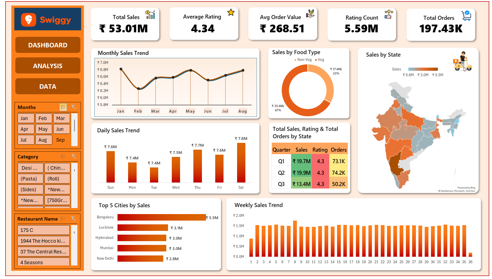

# Swiggy Sales Analysis (Excel Data Science Project)

This project focuses on analyzing **Swiggy food delivery sales data** using **Microsoft Excel** to uncover meaningful business insights.  
The analysis explores sales trends, customer ratings, order patterns, food preferences, and regional performance through an interactive dashboard.

The goal of this project is to demonstrate **data cleaning, analysis, visualization, and insight generation** skills using Excel.

---

##  Dashboard Preview

>  *Below is the interactive dashboard created in Excel*

>  Upload your dashboard image as `dashboard.png` in the root folder of this repository for the image to display correctly.

---

##  Dataset Overview

The dataset contains order-level food delivery data with the following attributes:

- **State** – State where the order was placed  
- **City** – City of the customer  
- **Order Date** – Date of the order  
- **Restaurant Name** – Name of the restaurant  
- **Location** – Area/locality of the restaurant  
- **Category** – Food category (Veg / Non-Veg / Recommended, etc.)  
- **Dish Name** – Ordered food item  
- **Price (INR)** – Price of the dish  
- **Rating** – Customer rating for the dish  
- **Rating Count** – Number of ratings received  

---

##  Tools & Technologies Used

| Tool | Purpose |
|------|--------|
| **Microsoft Excel** | Data cleaning, analysis & visualization |
| **Pivot Tables & Pivot Charts** | Aggregation and trend analysis |
| **Excel Functions** | `SUMIFS`, `COUNTIFS`, `AVERAGE`, `IF`, etc. |
| **Slicers & Filters** | Interactive dashboard controls |

---

##  Steps Performed

1. **Data Cleaning**
   - Removed duplicates and inconsistencies
   - Standardized column names and formats
   - Handled missing and invalid values

2. **Data Analysis**
   - Monthly, weekly, and daily sales trends
   - Sales distribution by food type (Veg vs Non-Veg)
   - State-wise and city-wise performance analysis
   - Rating and order volume analysis

3. **Dashboard Creation**
   - KPI cards (Total Sales, Avg Rating, Avg Order Value, Total Orders)
   - Trend charts (Monthly, Weekly, Daily)
   - Donut chart for food type contribution
   - Map visualization for state-wise sales
   - Top cities and restaurant performance

---

##  Key Insights

- **Total Sales:** ₹53.01M  
- **Average Rating:** 4.34  
- **Average Order Value:** ₹268.51  
- **Total Orders:** 197.43K  
- **Veg food contributes the majority of sales**
- **Bengaluru** is the top-performing city by sales
- Sales peak during **weekends**, especially Saturdays
- Q1 and Q2 show higher sales compared to Q3

---

##  Business Recommendations

- Focus promotional campaigns on **high-performing cities and states**
- Increase visibility for **top-rated dishes**
- Optimize weekend offers to maximize order volume
- Improve ratings for low-performing restaurants to boost trust

---

##  Project Files

- `Swiggy Sales Data.xlsx` – Raw & cleaned data
- `Swiggy Sales Dashboard.xlsx` – Interactive Excel dashboard
- `dashboard.png` – Dashboard preview image
- `README.md` – Project documentation

---

##  Future Enhancements

- Build a **Power BI / Tableau** version of the dashboard
- Perform deeper analysis using **Python (Pandas & Matplotlib)**
- Apply **predictive analytics** for demand forecasting

---

⭐ If you found this project helpful, feel free to **star the repository**!
